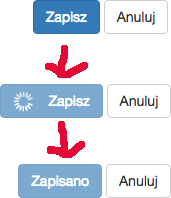

## ng2-button-loader ##

Button with loader for angular 2 apps.

To install package run:

    npm install ng2-button-loader --save

First import it:

    import { Log, Level } from 'ng2-button-loader/ng2-button-loader'

Simple use:

include directive:

    ...
    directives: [ ButtonSaveComponent ]
    ....

in html

     <button-save [id]="myButton" 
            textSuccess="Is done !"
            textError="Something bad"
     > SAVE </button-save>

when you create save button:

    ButtonSaveComponent.setState(this.t('save'), ButtonState.LOADING);
     this.service.model.update(model).subscribe(data => {
         ButtonSaveComponent.setState(this.t('save'), ButtonState.FINISH);
     }, () => {
         ButtonSaveComponent.setState(this.t('save'), ButtonState.ERROR);
     });

